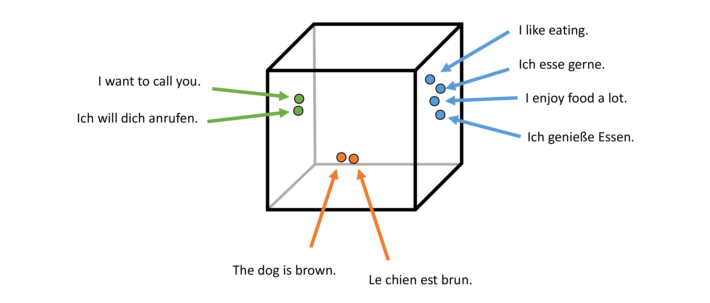

# Vecalign

Vecalign is an accurate sentence alignment algorithm which is fast even for very long documents.
In conjunction with [LASER](https://github.com/facebookresearch/LASER), Vecalign 
works in about 100 languages (i.e. 100^2 language pairs), 
without the need for a machine translation system or lexicon. 

Vecalign uses similarity of multilingual sentence embeddings to judge the similarity of sentences.


[image based on [this Facebook AI post](https://engineering.fb.com/ai-research/laser-multilingual-sentence-embeddings/)]

Vecalign uses an approximation to Dynamic Programming based on 
[Fast Dynamic Time Warping](https://content.iospress.com/articles/intelligent-data-analysis/ida00303)
which is linear in time and space with respect to the number of sentences being aligned. 


### License 

Copyright 2019 Brian Thompson

Vecalign is released under the [Apache License, Version 2.0](LICENSE).
For convenience, the dev and test datasets from Bleualign are provided. Bleualign is Copyright 2010 Rico Sennrich and is released under the [GNU General Public License Version 2](bleualign_data/LICENSE)

### Build Vecalign

You will need python 3.6+ with numpy and cython. You can build an environment using conda as follows:

```
# Use latest conda
conda update conda -y
# Create conda environment
conda create  --force -y --name vecalign python=3.7
# Activate new environment
source `conda info --base`/etc/profile.d/conda.sh # See: https://github.com/conda/conda/issues/7980
conda activate vecalign
# Install required packages
conda install -y -c anaconda cython
conda install -y -c anaconda numpy
pip install mcerp 
```

Note that Vecalign contains cython code, but there is no need to build it manually as it is compiled automatically by [pyximport](https://github.com/cython/cython/tree/master/pyximport).

### Run Vecalign (using provided embeddings)
```
./vecalign.py --alignment_max_size 8 --src bleualign_data/dev.de --tgt bleualign_data/dev.fr \
   --src_embed bleualign_data/overlaps.de bleualign_data/overlaps.de.emb  \
   --tgt_embed bleualign_data/overlaps.fr bleualign_data/overlaps.fr.emb
```

Alignments are written to stdout:
```
[0]:[0]:0.156006
[1]:[1]:0.160997
[2]:[2]:0.217155
[3]:[3]:0.361439
[4]:[4]:0.346332
[5]:[5]:0.211873
[6]:[6, 7, 8]:0.507506
[7]:[9]:0.252747
[8, 9]:[10, 11, 12]:0.139594
[10, 11]:[13]:0.273751
[12]:[14]:0.165397
[13]:[15, 16, 17]:0.436312
[14]:[18, 19, 20, 21]:0.734142
[]:[22]:0.000000
[]:[23]:0.000000
[]:[24]:0.000000
[]:[25]:0.000000
[15]:[26, 27, 28]:0.840094
...
```

The first two entries are the source and target sentence indexes for each alignment, respectively. 
The third entry in each line is the sentence alignment cost computed by Vecalign. 
Note that this cost includes normalization but does *not* include the penalties terms for containing more than one sentence. 
Note that the alignment cost is set to zero for insertions/deletions. 
Also note that the results may vary slightly due to randomness in the normalization.

To score against a gold alignment, use the "-g" flag.
Flags "-s", "-t", and "-g" can accept multiple arguments. This is primarily useful for scoring, as the output alignments will all be concatenated together in stdout. For example, to align and score the bleualign test set: 
```
./vecalign.py --alignment_max_size 8 --src bleualign_data/test*.de --tgt bleualign_data/test*.fr \
   --gold bleualign_data/test*.defr  \
   --src_embed bleualign_data/overlaps.de bleualign_data/overlaps.de.emb  \
   --tgt_embed bleualign_data/overlaps.fr bleualign_data/overlaps.fr.emb > /dev/null
```
Which should give you results that approximately match the Vecalign paper:

```

 ---------------------------------
|             |  Strict |    Lax  |
| Precision   |   0.899 |   0.985 |
| Recall      |   0.904 |   0.987 |
| F1          |   0.902 |   0.986 |
 ---------------------------------
```

Note: Run `./vecalign.py -h` for full sentence alignment usage and options. 
For stand-alone scoring against a gold reference, see [score.py](score.py)

### Embed your own documents

The Vecalign repository contains overlap and embedding files for the Bluealign dev/test files. 
This section shows how those files were made, as an example for running on new data.

Vecalign requires not only embeddings of sentences in each document, 
but also embeddings of *concatenations* of consecutive sentences.
The embeddings of multiple, consecutive sentences are needed to consider 1-many, many-1, and many-many alignments.


To create a file containing all the sentence combinations in the dev and test files from Bleualign:
```
./overlap.py -i bleualign_data/dev.fr bleualign_data/test*.fr -o bleualign_data/overlaps.fr -n 10
./overlap.py -i bleualign_data/dev.de bleualign_data/test*.de -o bleualign_data/overlaps.de -n 10
```

Note: Run `./overlap.py -h` to see full set of embedding options. 

`bleualign_data/overlaps.fr` and `bleualign_data/overlaps.de` are text files containing one or more sentences per line. 

These files must then be embedded using a multilingual sentence embedder.

We recommend the [Language-Agnostic SEntence Representations (LASER)](https://github.com/facebookresearch/LASER) 
toolkit from Facebook, as it has strong performance and comes with a pretrained model which works well in about 100 languages. 
However, Vecalign should also work with other embedding methods as well. Embeddings should be provided as a binary file containing float32 values.

The following assumes LASER is installed and the LASER environmental variable has been set.

To embed the Bleualign files using LASER:
```
$LASER/tasks/embed/embed.sh bleualign_data/overlaps.fr bleualign_data/overlaps.fr.emb [fra]
$LASER/tasks/embed/embed.sh bleualign_data/overlaps.de bleualign_data/overlaps.de.emb [deu]
```

> Please always refer [here](https://github.com/facebookresearch/LASER/blob/main/tasks/embed/README.md) for the latest usage of this script. The usage may vary across the different versions of LASER.

Note that LASER will not overwrite an embedding file if it exsts, so you may need to run first `rm bleualign_data/overlaps.fr.emb bleualign_data/overlaps.de.emb`.

### Document Alignment

[We propose](https://aclanthology.org/2020.emnlp-main.483) using Vecalign to rescore document alignment candidates, 
in conjunction with candidate generation using a document embedding method that retains sentence order information.
Example code for our document embedding method is provided [here](standalone_document_embedding_demo.py).

### Publications

If you use Vecalign, please cite our [Vecalign paper](https://www.aclweb.org/anthology/D19-1136):

```
@inproceedings{thompson-koehn-2019-vecalign,
    title = "{V}ecalign: Improved Sentence Alignment in Linear Time and Space",
    author = "Thompson, Brian and Koehn, Philipp",
    booktitle = "Proceedings of the 2019 Conference on Empirical Methods in Natural Language Processing and the 9th International Joint Conference on Natural Language Processing (EMNLP-IJCNLP)",
    month = nov,
    year = "2019",
    address = "Hong Kong, China",
    publisher = "Association for Computational Linguistics",
    url = "https://www.aclweb.org/anthology/D19-1136",
    doi = "10.18653/v1/D19-1136",
    pages = "1342--1348",
}
```

If you use the provided document embedding code or use Vecalign for document alignment, please cite our [document alignment paper](https://aclanthology.org/2020.emnlp-main.483):

```
@inproceedings{thompson-koehn-2020-exploiting,
    title = "Exploiting Sentence Order in Document Alignment",
    author = "Thompson, Brian  and
      Koehn, Philipp",
    booktitle = "Proceedings of the 2020 Conference on Empirical Methods in Natural Language Processing (EMNLP)",
    month = nov,
    year = "2020",
    address = "Online",
    publisher = "Association for Computational Linguistics",
    url = "https://aclanthology.org/2020.emnlp-main.483",
    doi = "10.18653/v1/2020.emnlp-main.483",
    pages = "5997--6007",
}
```
